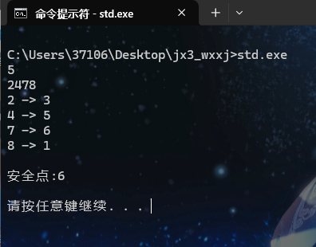
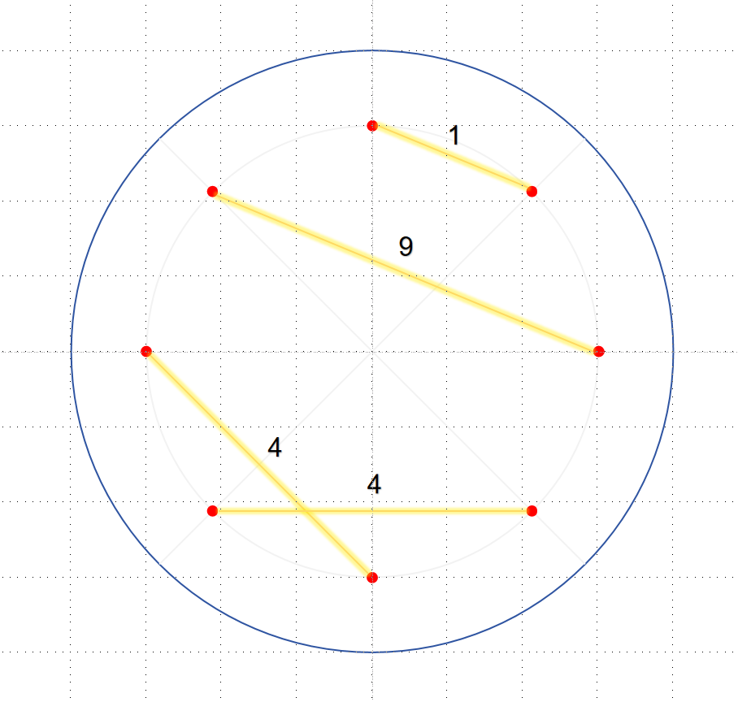

# 无相玄机阶段脑死流分配分身和安全点



[github链接地址](https://github.com/Arcturus1350/jx3_wxxj)

---

### 快速使用

windows系统按下Win+R，运行cmd。(打开命令提示符)

运行

```
git clone ...

cd jx3_wxxj

std.exe

```

11.5 现在可双击运行

###### 输入格式：

第一行一个数n，表示近战比较多的组，被分配到标记对应的点编号

第二行4个数(可以不带空格)，表示玩家控制的分身对应的点编号

**温馨提示，没有加输入内容的正确性判断，不要输入错误的内容**

###### 输入样例：
```
5
1234
```

###### 输出样例:
```
1 -> 7
2 -> 8
3 -> 5
4 -> 6

安全点:5
```
---

### 需要做的：

建议外场的人使用，僵直前站到场中光柱

下p后第一时间选择近战组对应的标记m，看对应的点位。(同时，4t看自己分身所在的点位，打字到团队频道)

Alt+Tab切屏输入m，同时看团队频道摁回车输入四个p，再回车

然后先喊安全点，再含对应关系

一般第一轮挡线结束即可喊完

之后如果t没有听清，则直接开麦/打字要求重复

最后团队频道打字**安全点：k**

---

### 分身分配 问题转化

#### 原始问题:

有8个点围成一个圈，按照顺序编号1,2,3,...,8

每一轮都会从8个点中随机选取4个点(player)，p1,p2,p3,p4。剩下没被选的点(system)编号q1,q2,q3,q4。

现在要将p和q进行一一配对(分配分身)。保证对dps的影响尽可能的小。

##### 分析：

首先我们肯定，对于8个点的配对，总共4对。

下面这张图中左下四个点的配对方式对dps的影响一定比右上四个点的影响小 (更优)



并且在任何情况下，都不应该出现配对的连线穿过中场。

因此为了符合这种模型，我们定义，每一个配对之间对dps的影响，是俩个点之间环上间距的平方。

上张图的示例展示了每组配对(金线)对dps的影响的量化表现

我们的目标是最小化这个值

#### 转化成算法问题:

##### 问题描述

场地上有2n个点围成一圈，按照顺序编号1,2,3,.....,2n，集合s={1,2,3,....,2n},总共有2n条边。之后从中选取n个点，成为集合p,对应数组p[i],i=1,2,.....,n，这样剩下的n个点组成集合q=s-p。

现在需要对集合p中每一个点，都在q集合中找到一个点一一对应，组成(p[i],q[i])。对于每一对点，定义他的花费cost[i]为： (从编号p[i]到编号q[i]的环上距离)的平方。

环上距离指的是从p[i]走到q[i]最少经过的边数，即 min((p[i]-q[i]),2n-(p[i]-q[i]))

因此cost[i]=min((p[i]-q[i]),(2n-(p[i]-q[i])))^2或者min((p[i]-q[i])^2,(2n-(p[i]-q[i]))^2)  提示：这两个是等价的

定义这张图的一种配对的总花费cost_all为 \sum_{i=1}^{n} cost[i] ，即每一对的cost之和
固定n=4。

需要对于我给出的一组p，我想找到这张图的一种配对，使得总花费cost_all最小

**有关算法相关内容在km.md中**

---

### 安全点选择 问题转化

最优安全点选择需要满足的条件：假设安全点编号为k，近战分组打的分身点为m。

- 保证安全点的对面是玩家控制的分身。即保证k的对面点在p集合中
- 保证安全点尽可能在m附近。
- 保证q集合中的点，到安全点k尽可能方便

因此综合评价下来，按照这个逻辑判断k：

判断m符不符合条件，符合则k=m

若m不符合条件，判断m+1,m-1(环上，具体取模省略)是否符合条件

如果只有一个符合条件，则k=符合条件的那个

若两个都符合条件，则计算两种\sum |q[i]-k|的距离，取最小的那个

若两个都不符合条件，再检查m-2,m+2(环上，具体取模省略)是否符合条件

---
